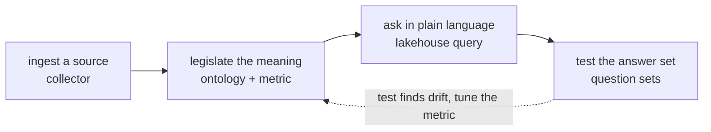

# Governance Is a Full-Stack Property

> Stitch Text-to-SQL, a semantic layer, a vector store, an agent and a BI tool into a demo and it runs for ninety seconds — but the one thing it can never give you is "when it's wrong, you know where to fix it." Because *governable* was never a feature of any single layer. It's a property a chain shares — ingest, legislate, query, test — with no break anywhere in between. This is about two things: why it has to be full-stack, and what lets full-stack go further than Text-to-SQL and the data-analysis tools you can buy today.

---

## After the applause

The demo is always the same: point an agent at a database, feed it the schema, ask a question in plain English, watch a number drift back. It looks like magic — for about ninety seconds.

The real question only gets asked once the applause dies down: **when it's wrong, where do I go to fix it?** Not whose fault — that's blame; but whether I can open one thing, change it, and stop seeing the same shape of error next week. The demo never shows that part. Not for lack of time, but because in its architecture **there is no such place to show.**

And *why there's no such place* turns out to be where every design decision in this system begins.

## Meaning leaks at the seams

Take an "AI analyst" apart and underneath you usually find a row of tools, each minding its own job: a semantic layer (dbt, Cube) for some of the metrics, a vector store for retrieval, an agent for reasoning, a BI tool for rendering, and — for a disciplined team — a few eval scripts hung off the side. Five tools in relay, four seams between them.

The trouble lives in the seams. The semantic layer knows "revenue," but not that *this* question wanted the pre-refund definition; the vector store pulls back a plausible-looking chunk, but can't say which authorized definition it stands for; the agent improvises across the gap. By the time a number lands on the dashboard, the thread of *why this number* has been cut in four different places. So when it's wrong, the error isn't anywhere — it's smeared across a crowd of tools that don't speak the same language. No address to fix, because no single system ever held the whole sentence end to end.

Which makes the way out clear: not a cleverer agent, not one more validation pass, but **refusing to let meaning be re-described at any seam at all.**

## Governability is a property of the chain

That leads to the claim of the whole piece: consistency, auditability, "every error has an address you can fix once" — none of these is a feature you bolt onto the query layer. They are properties the whole pipeline shares, or they don't exist.

A stitched-together stack can solemnly promise a governed metric and still let governance slip away at the ingest step, or through the gap where testing should have been. So coherence isn't an ornament on top of the governance story — it's the precondition that lets the story be true: you can only govern what one coherent system carries from one end to the other.

So text2ontology is deliberately built as **one** thing across the whole path, not as several things gathered in a room. And, more to the point, that one thing isn't a straight line you walk once — it's a loop that tightens on itself:

The same artifacts — objects, properties, links, metrics — thread through every stage: the definition you legislate is the one the query cites when it compiles, and the one the test checks when it replays. Nothing gets re-said at a seam, so nothing leaks at a seam.

And that dotted edge is where the system actually comes alive. When a question set finishes and some metric answered wrong — not the model glitching, but the definition itself not quite saying what you meant — you don't rebuild from scratch. You step back to the legislate stage, tune that one metric, and let query and test run again. The error gets fixed in place instead of being routed around by re-asking, and the metric grows sharper the more it's used. **That is the virtuous loop: every "that's wrong" becomes a chance to make the definition more right, instead of one more roll of the dice.**

## The two ends no one else keeps

What really sets it apart from the alternatives is the two ends of that pipeline.

It begins by **writing the oracle**: a metric (口径) is the legislated definition of a number — authored once, owned, versioned. It ends by **running the oracle**: a question set is a body of authorized answers, replayed against the live system again and again, the way you run a regression suite.

And those two ends are precisely the parts nearly every approach quietly files under "not my job." Laid side by side it's plainer:

| | Front: who decides the metric | Back: who keeps the answer from drifting |
|---|---|---|
| **Text-to-SQL** | Handed back to probability — every question re-guesses what "active user" means | None |
| **BI / semantic layer + humans** | One layer only; cross-question definitions still aligned by hand | Left to human eyes on a dashboard |
| **text2ontology** | Internalized: authored once, owned, versioned | Internalized: question sets replayed, like running tests |

Text-to-SQL hands the most dangerous end — who gets to say what the metric is — back to probability; the data-analysis tools hand the other end — whether the answer quietly drifts someday — to human eyes. Neither end is kept, so both ends leak. text2ontology brings both inside. That is what "full-stack" actually weighs here: not more features, but taking the judge in — its writing and its checking alike — instead of pretending data analysis can do without one.

## Your job is just to fill in the blanks

One coherent system sets down another burden along the way: **you no longer have to be the architect.**

Most "build your own semantic layer" tools hand you a blank canvas and a coil of rope — you have to think through an entire governance architecture before you can start. text2ontology hands you a structure already standing: object, property, link, metric — and asks you to follow the frame, filling it in one slot at a time. The load drops from "design a governance architecture" to "answer the next parameter the system asks you for."

For the business reader, this is the part that matters most: you don't have to assemble a data team and wire five tools together before you're allowed to begin. You just load a data source, legislate your numbers once (fill in parameters, not SQL), ask in plain language, and replay a test set — one system, one vocabulary, the whole way. You aren't architecting truth from nothing; you're legislating it into a shape that was already laid out for you. The distance between "a library you have to assemble yourself" and "a framework that carries you" is roughly the distance between the people who actually put it to use and the ones who quietly set it down in week three.

## From a CSV to an answer someone signed

So the thing underneath the philosophy is, in fact, plain: you don't assemble five tools and then pray the seams hold. You ingest, legislate, ask, replay — in one system, in one vocabulary, with a single chain of responsibility drawn unbroken from the raw file all the way to the final number.

That unbroken chain is the whole point: a wrong answer has somewhere to be fixed, a right answer has someone willing to sign it, and "fix it once" becomes a promise the system can actually keep. Governance was never going to survive being bolted on — it has to be full-stack, or it doesn't deserve the word at all.

---

*Part of the [text2ontology](https://github.com/agentofreef/text2ontology) series — start with the [Manifesto](/manifesto/) for the full thesis. Licensed under [CC BY 4.0](https://creativecommons.org/licenses/by/4.0/).*

AgentOfReef · 2026-06
