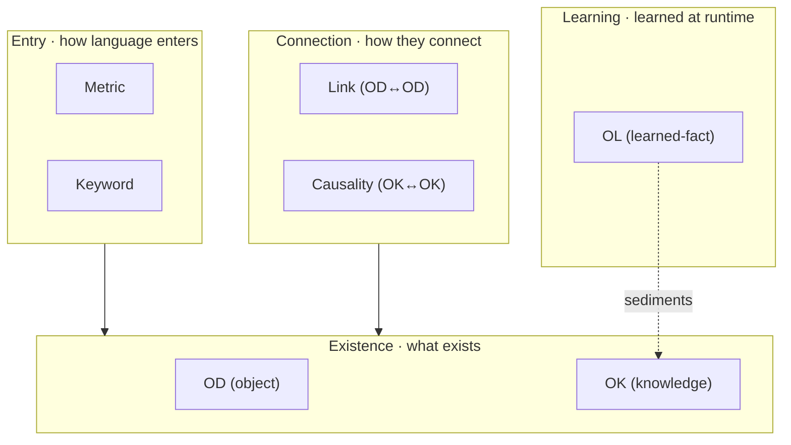
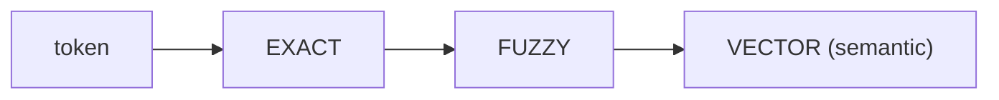

# Core Concepts

> Ontology, OD, Metric, Keyword, the two agent modes, three-tier recall, and the three hard invariants.

---

This is the ontology vocabulary. You don't need all of it, but **you do need OD, Metric, and Keyword** — day-to-day correction happens in those three places.

> **Terminology note**: what the UI and code call **"Metric"** is what the early manifesto / design philosophy call **"Intent"**, and the database table is `lakehouse_metric_intent` — **all three are the same concept**. This documentation uses "Metric" throughout.

## The 7 core concepts

| Concept | Table | The tension it resolves | Touch it? |
|---|---|---|---|
| **OD** (Object Definition) | `ont_object_type` + `ont_property` | Business entity vs. physical table decoupling | ★ yes |
| **Property** | `ont_property` | A field / dimension / measure on an OD | ★ yes |
| **Link** | `ont_link_type` | Makes physical JOIN paths explicit (OD↔OD) | aware |
| **OK** (Knowledge) | `ont_knowledge` | Business structure vs. business knowledge | advanced |
| **OL** (Learned-fact) | `ont_learned_fact` | Static knowledge vs. dynamic learning | advanced |
| **Causality** | `ont_causality` | Business causation vs. physical relation | advanced |
| **Metric** | `lakehouse_metric_intent` | Bridges NL vagueness to SQL determinism | ★★ key |
| **Keyword** | `lakehouse_keyword` | Dual-channel entry: literal + semantic match | ★★ key |

## Three-layer ontology lifecycle

Dependencies flow **one way, downward**: Entry references Existence, Connection sits on Existence, Learning is a byproduct.

## A few key relationships

- **OD and Property**: an OD is a business object (e.g. "Order"); under it hang Properties (fields / dimensions / measures, e.g. "order quantity", "geo", "order date"). One OD has **exactly one** `semantic_sql`, which may span any number of physical tables — **physical tables are an implementation detail; the OD is the business encapsulation.**
- **Metric and Keyword**: a **Metric** is a query template (anchored on one OD: measure / filters / auto-group-by / pivot). A **Keyword** is a trigger word (points at a Property or at a Metric). Together they turn plain language into a deterministic query.
- **OD and OK**: an OK only exists attached to an OD — it's the OD's "semantic patch" (e.g. "this company's business definition of early order").

## Why multi-table queries stop being a problem

Text-to-SQL fails not because an LLM can't write SQL, but because a multi-table query forces it to decide **three things at once**: which tables, how to JOIN, how to lay out WHERE / GROUP BY. Any one wrong takes the whole query down. Past three tables, accuracy falls off a cliff.

The ontology architecture **physically separates** those decisions:

| Decision | By whom | How |
|---|---|---|
| Which business objects | LLM | Pick from the pre-connected OD network (finite-set selection) |
| Which query shape | LLM | Pick from the Metrics bound to those ODs (finite-set selection) |
| Parameters | LLM | Recall Keywords from the question (recall, not generation) |
| **JOIN / SQL assembly** | **SmartQuery engine** | **Stitched along Links — no LLM involved** |

> **The LLM never sees a JOIN.** Everything it does is picking from finite sets, not writing. Assembly is done by deterministic code in `lakehouse-sql-server`.

## Three-tier cascading recall (the runtime core, no LLM)

Every question is **force-tokenized**; each token runs three cascading tiers:

> **"Tokenize + recall" is deterministic backend SQL code, no LLM.**
> **The LLM is a constrained executor, not a source of truth — it can only pick from recalled context, fill parameters, and call tools.**

Vector recall uses `bge-large-zh` embeddings; vector columns are `vector(1024)` (pgvector). So **to make semantic recall work, configure an embedding model** in LLM config.

## The two agent modes

Two independent agent modes, distinguished by `agent_type` on the thread (immutable once set):

| Mode | Purpose |
|---|---|
| **lakehouse** (query) | NL → recall → pick a Metric + fill params → SmartQuery → answer |
| **builder** (modeling) | Interview-driven OD / Metric / Link creation, **human-activated** |

## Three hard invariants (enforced by architecture)

1. **OD necessity** — a project with no active OD: the query tool refuses to run.
2. **OD 1:1 semantic_sql** — every active OD has exactly one SQL definition (may reference many physical tables).
3. **No island OD** — with more than one active OD, every active OD must connect to another via at least one active Link.
