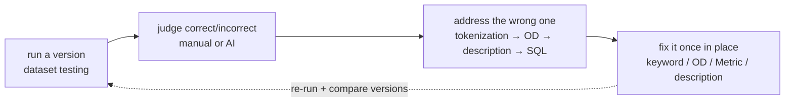

# The Debug Loop

> Every wrong answer has an address. Tokenization first, then the OD, then descriptions, then the SQL — a decision tree.

---

When an answer is wrong, don't retry and don't re-prompt. Every error has an **address** — walk the decision tree below, find it, and fix it once.

## This is a loop, not a one-off

Debugging isn't firefighting after something breaks; it's the system's **main mode of work.** Picture it as a loop:

The [question set](/docs/question-sets/) gives you the **entry point** (which ones failed); this loop tells you **where each failure's address is, and how to fix it once so it doesn't come back.** That dotted edge is the crux: after you fix, **run a new version and N-way compare** — and you'll watch the fixed questions stay fixed. That ratchet is what separates this from traditional BI.

## Where debugging happens: the case detail is your cockpit

You don't have to hunt for clues. Open any case in **Dataset Testing** and its detail panel already lays the scene out:

- **Tokenization** (how the sentence split into tokens, and what each matched)
- **Every tool-call round** (which Metric the LLM picked, which parameters it filled)
- **`generated_sql`** (the SQL SmartQuery actually stitched)
- **Execution result / error**
- **The final answer**

In other words, there's no black box between "it's wrong" and "see why it's wrong." The decision tree below is just the order in which you read that scene.

## The decision tree: start at tokenization

### ① First reaction: check tokenization

**When a user's question doesn't match your expectation — or no data comes back at all — your first reaction should be to check whether the tokenization is right.**

Tokenization is the linchpin of the whole system (60%+ of the pipeline depends on it). Its job is to **make the LLM understand the keywords in your question**; only with the right keywords can the system reverse-infer the right ontology and properties.

Go to **Agent → Token Recall** (`/ontology/lakehouse-agent/token-recall`) to see how the sentence tokenized and what it recalled; go to **Knowledge Engineering → Keyword Triage** (`/ontology/lakehouse-keyword-triage`) to add missing words, fix aliases, and adjust priority.

> **An honest word on tokenization**: there is no especially good general solution yet. When your domain is very specific, or the question involves complex proper-noun keywords, there frankly is no silver bullet — which is exactly why it's the place to spend your attention.

### ② Tokenization is right but it's still wrong → check the OD the LLM found

If tokenization is entirely correct but the result is still off, **next check whether the ontology (OD) the LLM found is correct.** The tool-call rounds in the case detail tell you directly which OD it anchored on.

### ③ The OD is wrong → revisit the ontology description

If the OD it found is itself wrong, **go back and reconsider: is your (natural-language) description of the ontology correct?** The description is what the Agent uses to understand an OD (see [Step 2](/docs/builder-mode/)); a vague or ambiguous description leads to the wrong OD being picked.

### ④ The OD is right but the numbers are wrong → check properties / table / SQL / keys

If the OD is correct but **the numbers come back wrong**, the problem is one layer down: **the OD's properties, or the database table the properties map to, may be at fault.** Read the `generated_sql` and execution result in the case detail, and check, item by item:

- Is the `semantic_sql` (the "describe SQL") correct?
- Are the **primary/foreign keys (join keys)** between tables wired correctly?
- Can the **text descriptions** of the OD and its dimensions be improved?
- Is there **concept overlap** (two ODs that actually describe the same thing)?

> Concept overlap is a sneaky source of error. If you find overlap, return to the "concept fusion" principle from [Step 2](/docs/builder-mode/): if it can be fused into one ontology, don't split it.

## Symptom → where to fix (quick reference)

| Symptom | Where to fix | Page |
|---|---|---|
| Tokenization wrong / a word not understood | **Keyword Triage** | `/ontology/lakehouse-keyword-triage` |
| Inspect tokenization + recall | **Token Recall** | `/ontology/lakehouse-agent/token-recall` |
| No metric covers a dimension | **Metrics** (create) | `/ontology/lakehouse-metrics` |
| Add / edit / remove keywords | **Keywords** | `/ontology/lakehouse-keywords` |
| OD description / semantic_sql / properties / Link | **Ontology** | `/ontology/lakehouse-objects` |
| Annotate a decision, confirm tokenization | **Annotations** | `/ontology/lakehouse-agent/annotations` |
| Regression-test, diff versions, read a case's scene | **Dataset Testing** | `/ontology/lakehouse-agent/dataset-testing` |

## Why it's worth it

You curate, annotate, activate; it isn't open-the-box-in-fifteen-minutes. What you get back is this: **once an answer is fixed, it stays fixed** — because the error has an address, you fix it there, and the same shape of mistake doesn't return next week. Every fix makes the system a little sharper, and **what's fixed doesn't regress.** That visible, week-over-week compounding convergence is something neither traditional BI nor "a bigger model" can give you.
