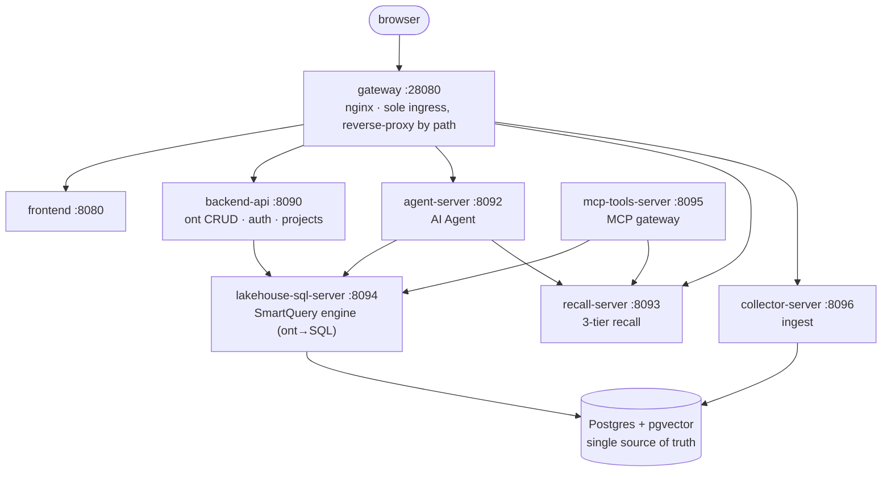

# Installation & First Boot

> Bring the whole stack up with one command, sign in, configure an LLM, and create a project.

---

## Prerequisites

Docker (with `docker compose` v2+).

## Start the whole stack

Two commands bring everything up — schema, least-privilege DB roles, and observability are wired automatically. Default local login is `admin / admin`.

```bash
# 1. clone
git clone https://github.com/agentofreef/text2ontology
cd text2ontology

# 2. start everything (pulls prebuilt GHCR images + applies schema, ~1–3 min first time)
docker compose up -d

# 3. verify (the gateway is the sole public ingress)
curl -fsS http://localhost:28080/healthz   # -> ok

# 4. open
open http://localhost:28080
```

No `.env`, no flags — every secret has a safe dev default baked into `docker-compose.yml`.

> **Status**: the stack comes up clean but **the UI is empty until you ingest data**. An empty UI is expected.

Lifecycle:

```bash
docker compose logs -f gateway
docker compose down            # stop, keep the DB volume
docker compose down -v         # stop and WIPE the DB volume (careful)
git pull && docker compose pull && docker compose up -d   # update to latest images
```

The Makefile wraps the same: `make up` / `make down` / `make health` / `make logs SVC=agent-server` / `make db-psql`.

## What got deployed (architecture at a glance)

Eight images (gateway + frontend + 6 Go services) plus Postgres and the observability stack. **Only the gateway publishes a host port (`28080`)**; everything else is reachable only on the internal Docker network.



Per-service role (ports are **internal**):

- **gateway** `:28080` (public) — nginx, sole external ingress, reverse-proxy by path
- **frontend** `:8080` — Next.js static export
- **backend-api** `:8090` — CRUD for `ont_*` / `lakehouse_*`, auth, projects, export/import
- **agent-server** `:8092` — Lakehouse Agent SSE (lakehouse / builder), annotations, dataset testing
- **recall-server** `:8093` — EXACT + vector + metric recall
- **lakehouse-sql-server** `:8094` — SmartQuery engine (deterministic ontology → SQL). **The LLM never sees a table or a JOIN.**
- **mcp-tools-server** `:8095` — MCP tool gateway for external clients (Claude Code, etc.)
- **collector-server** `:8096` — the **sole** data-ingest entrypoint

Base image `pgvector/pgvector:pg16`; a one-shot `db-migrate` container builds the schema, creates least-privilege roles, and runs migrations on boot. Observability UIs (Jaeger `:16686` / Prometheus `:9090` / Grafana `:3000`) bind to `127.0.0.1` only.

## First-boot, three steps

### 1. Sign in

Open `http://localhost:28080`, sign in as `admin / admin` (local default). In production, use the `ADMIN_PASSWORD` you set in `.env`.

### 2. Configure an LLM (required to use the Agent)

Go to **System → LLM Config** (`/settings/llm-config`) and add at least one **chat model**, then **activate it for the chat role**:

- vendor (Claude / OpenAI / DeepSeek / Qwen) + base URL + API key + model name
- **Keys live in the database and load per-role at runtime — no env change, no container restart.**

Also configure an **embedding model** (a 1024-dim model like `bge-large-zh`), otherwise the vector tier (VEC) of three-tier recall is inert and you fall back to EXACT/FUZZY only.

### 3. Create a project

The **project switcher** sits at the top-left of the sidebar. Open it → "New project" enters `/setup-wizard`. Each project is its own ontology + data + access boundary (every `ont_*` / `lakehouse_*` table carries a `project_id`).

Next: **[Setup & Collaboration](/docs/workflow/)** — see the three steps and the business/technical role split before you start configuring.
