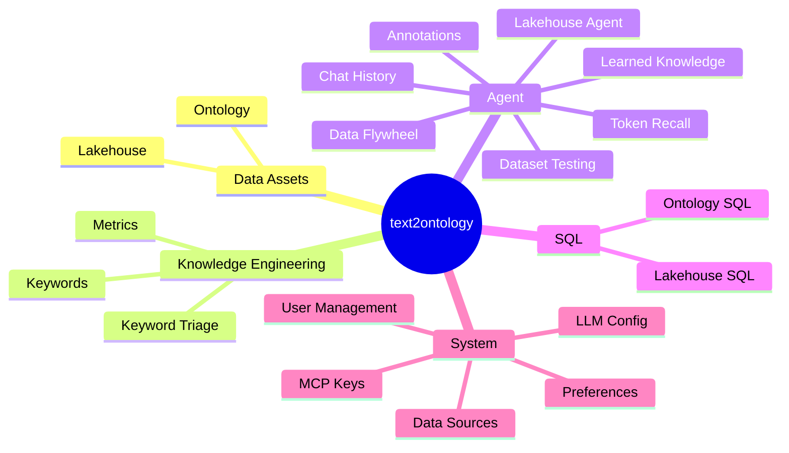

# Interface Reference

> A map of the sidebar — every page and what it is for.

---

After you sign in and select a project, the sidebar groups as follows (with no project selected, only the System group shows).

> The **project switcher** sits top-left (switch / new / delete project).

**Route reference**

| Group | Page | Route |
|---|---|---|
| Data Assets | Lakehouse | `/ontology/lakehouse` |
| Data Assets | Ontology (OD list + property graph) | `/ontology/lakehouse-objects` |
| Knowledge Engineering | Keywords | `/ontology/lakehouse-keywords` |
| Knowledge Engineering | Keyword Triage | `/ontology/lakehouse-keyword-triage` |
| Knowledge Engineering | Metrics | `/ontology/lakehouse-metric-intents` |
| Agent | Lakehouse Agent (main chat) | `/ontology/lakehouse-agent` |
| Agent | Chat History | `/ontology/lakehouse-agent/history` |
| Agent | Annotations | `/ontology/lakehouse-agent/annotations` |
| Agent | Token Recall | `/ontology/lakehouse-agent/token-recall` |
| Agent | Learned Knowledge | `/ontology/lakehouse-agent/knowledge-learned` |
| Agent | Dataset Testing | `/ontology/lakehouse-agent/dataset-testing` |
| Agent | Data Flywheel | `/ontology/lakehouse-agent/flywheel` |
| SQL | Ontology SQL | `/ontology/sql-passthrough` |
| SQL | Lakehouse SQL | `/ontology/lakehouse-sql` |
| System | Data Sources | `/settings/data-sources` |
| System | LLM Config | `/settings/llm-config` |
| System | MCP Keys | `/settings/mcp-keys` |
| System | Preferences | `/settings/preferences` |
| System | User Management (admin only) | `/settings/users` |

## Group by group

### Data Assets

- **Lakehouse** — view the physical data you ingested.
- **Ontology** — OD list + property graph (merged into one split view). Where you view / manage ODs and Properties.

### Knowledge Engineering (the correction battleground)

- **Keywords** — CRUD on keywords.
- **Keyword Triage** — fix tokenization: add missing words, fix aliases, adjust metric priority.
- **Metrics** — create / edit metrics (measure, filters, auto-group-by, pivot).

### Agent

- **Lakehouse Agent** — the main chat page; both lakehouse (query) and builder (modeling) modes live here.
- Sub-pages: Chat History, Annotations, Token Recall, Learned Knowledge, Dataset Testing, Data Flywheel.

### SQL (advanced)

- **Ontology SQL** — ontology semantic SQL.
- **Lakehouse SQL** — query the lakehouse directly.

### System

- **Data Sources / LLM Config / MCP Keys / Preferences**, plus **User Management** (admin only).

> Note: the ER Diagram (`/ontology/er-diagram`) and Prompt Engineering (`/settings/prompt-config`) pages still exist but are hidden from the sidebar. All routes live under the `/lakehouse` base path + a locale segment.
