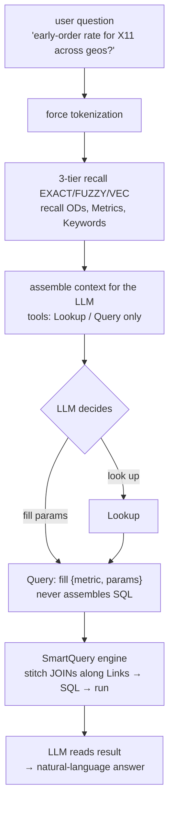

# Query Mode: Ask Questions

> How a question flows to an answer, the reachability gate, and why the AI never fabricates a number.

---

With the ontology active, switch to **lakehouse (query) mode** in **Agent → Lakehouse Agent** and start asking.

## What happens inside one question

## Two honesty mechanisms that matter to users

### 1. Before anything runs, "can this even be answered?" (the reachability gate)

The system first decomposes the question into the dimensions / filters it needs, and **mechanically checks each one against the authorized Metrics**. Any one uncovered → the whole question is judged **infeasible** → it **refuses to answer + gives a precise reason** (e.g. "no authorized Metric provides the «X» dimension").

This is **binary and whole-question** — **it would rather not answer than answer wrong.** It also handles **follow-ups / context** (prior questions + the AI's final answers are carried into the judgment).

### 2. Numbers in the final answer always come from the query result — never fabricated

Across the entire tool-call chain, the LLM **never writes a number** — everything it emits is a structural reference (a pointer like `t1.qty[3]`), and a mechanical layer resolves the pointer to the true value. Any "copying a value from a tool result" is flagged at the interceptor as `POINTER_INVARIANT_VIOLATED`.

> **The numbers the user sees equal exactly what the tool returned — the possibility of fabrication is structurally eliminated.**

## What to expect

**The first answer will probably be off. That's normal.** This system's intelligence is **accumulated, not granted** by the model. Every question is teaching, not consumption — correct it once and the next answer is better.

> Skip correction → it stays at cold start forever. Practice it → error rate compounds downward week by week.

When it's wrong, don't retry or re-prompt — fix it at the right **address**. How, in **[The Correction Flywheel](/docs/correction-flywheel/)**.
