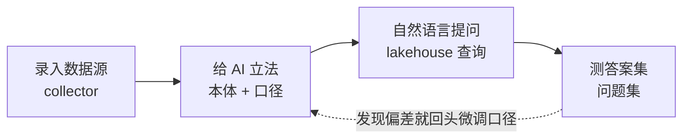

# 治理是一种全栈属性

> 把 Text-to-SQL、语义层、向量库、agent、BI 拼成一个 demo,它能演九十秒;但"答错了知道去哪改"这件事,它永远给不了。因为"可治理"从来不是某一层的功能,而是一条链共有的属性——录入、立口径、查询、测试,中间一处都不能断。这篇想说清两件事:为什么非全栈不可,以及全栈凭什么比 Text-to-SQL 和现成的数据分析工具走得更远。

---

## 掌声落下之后

demo 永远是同一套:把 agent 接上数据库,schema 喂进去,大白话问一句,一个数飘回来,像魔法——能像九十秒。

真正的问题,总要等掌声落下之后才被问出口:**它答错的时候,我去哪儿改?** 不是追究谁的错——那是甩锅;而是,我能不能打开某一处、改一下,让下个礼拜不再撞上同样形状的错。demo 从不演这一段。倒不是来不及,而是在它的架构里,**根本没有这样一处地方可演**。

而"为什么没有这样一处地方",恰恰是这套系统所有设计的起点。

## 意义在接缝处漏掉

把一个"AI 分析师"拆开,底下多半是一组各司其职的工具:语义层(dbt、Cube)管一部分指标,向量库做检索,agent 做推理,BI 做渲染,讲究的团队再在旁边挂几个 eval 脚本。五个工具接力,四道接缝。

麻烦就藏在接缝里。语义层认得"收入",却不知道这一问要的是退款前那个口径;向量库捞回一个看着像的片段,却说不清它代表哪一条被授权过的定义;agent 就在缝隙之间即兴发挥。等数字落到 dashboard 上,"它为什么是这个数"那条线索,已经在四个地方先后被剪断。于是答错时,错不落在任何一处,而是被抹散在一群彼此不讲同一种话的工具之间——没有地址可改,因为没有任何一个系统,从头到尾握着完整的那句话。

出路也就清楚了:不是换一个更聪明的 agent,也不是再加一层校验,而是**不让意义在任何一道接缝上被重新描述一次**。

## 可治理,是一条链的属性

这就引到全篇的主张:一致性、可审计、"每个错都有一个能改一次的地址"——这些都不是能往查询层上外挂的功能。它们要么是整条流水线共有的属性,要么根本不存在。

一套拼装的栈,可以郑重承诺一个"被治理过的指标",却仍旧会在录入那一步、或测试那道缺口上,把治理悄悄漏掉。所以连贯不是治理叙事顶上的装饰,而是它能成立的前提:你只能治理一套连贯系统从头贯到尾的东西。

text2ontology 因此被刻意做成贯穿全程的**一套**,而不是凑在一起的若干件。更要紧的是,这一套不是一条用完即弃的直线,而是一个会自我收紧的环:

同一批 artifact——对象、属性、关系、口径——穿过每一个阶段:你立下的那条定义,就是查询编译时援引的那条,也是测试回放时核对的那条。没有什么在接缝处被重说一遍,自然也没有什么在接缝处漏掉。

而那条虚线,才是这套系统真正活起来的地方。当一组问题集跑完,某个口径答得不对——不是模型抽风,是这条定义本身没说准——你不必从头再搭一遍,只需回到立法那一步,把那一条口径微调一下,让查询和测试重新跑一遍。错被就地改掉,而不是被重新提问绕过去;口径于是越用越准。**这就是那个良性循环:每一次"答错了",都变成一次把定义改得更对的机会,而不是又一次祈祷。**

## 别人都不收的那两端

真正让它和其它方案分道扬镳的,是这条流水线的两端。

它从**写裁判**开始:一条口径,就是一个数的法定定义,写一次、有归属、有版本。它到**跑裁判**为止:一个问题集,就是一组被授权过的答案,拿去对线上系统反复重放,像跑回归测试。

偏偏这两端,是几乎所有方案都默认"不归我管"的部分。摆到台面上看得更清楚:

| | 前端:口径由谁说了算 | 后端:谁保证答案不悄悄变 |
|---|---|---|
| **Text-to-SQL** | 交还给概率——每问一次,模型重新猜一遍"活跃用户"是什么 | 没有 |
| **BI / 语义层 + 人工** | 只覆盖某一层,跨问题的口径仍要人去对齐 | 交给人的眼睛——盯着 dashboard |
| **text2ontology** | 收进系统:写一次、有归属、有版本 | 收进系统:问题集回放,像跑测试 |

Text-to-SQL 把最凶险的一端——口径由谁说了算——交还给了概率;现成的数据分析工具,则把另一端——答案会不会在某天悄悄变样——交给了人的眼睛。两端都没人接,于是两端都在漏。text2ontology 把它们一起请进门。这才是"全栈"在这里真正的分量:不是功能更多,而是把裁判——连同它的书写和它的核对——一并收下,而不再假装数据分析可以没有裁判。

## 你要做的,只是把空填上

一套连贯的系统,还顺手卸下了一个担子:**你不必再当架构师。**

多数"自己搭语义层"的工具,递给你的是一块白布和一捆绳子——你得先想清楚一整套治理架构,才谈得上开工。text2ontology 递给你的,是一个已经立好的结构:对象、属性、关系、口径,然后请你顺着这个框,一格一格往里填。负担于是从"设计一套治理架构",降到"回答系统问你的下一个参数"。

对业务的人,这一段最要紧:你不需要先攒起一个数据团队、把五个工具接通,才被允许开始。你只是录入一个数据源,给你的数字立一次法(填参数,而不是写 SQL),用大白话问,再重放一套测试集——全程一套系统、一套词汇。你不是在从无到有地架构真相,你是在把它立法进一个早已备好的形状里。"一个要你自己拼的库"和"一个会托着你走的框架",这之间的距离,差不多就是人们究竟把它用了起来、还是在第三周悄悄放下的距离。

## 从一个 CSV,到一张签了字的答案

所以哲学底下那句话,其实朴素得很:你不必拼起五个工具,再祈祷接缝撑得住。你录入、立法、发问、重放——在一套系统里,用一套词汇,让一条责任链从原始文件不断地一路牵到最终那个数字。

这条不断的链,就是全部的意义所在:错答有地方可改,对答有人肯签字,而"只改一次"成了系统真正兑现得起的承诺。治理从来无法靠外挂存活——它必得是全栈的,否则它根本配不上"治理"这两个字。

---

*[text2ontology](https://github.com/agentofreef/text2ontology) 系列的一部分——完整论点见[宣言](/zh/manifesto/)。本文以 [CC BY 4.0](https://creativecommons.org/licenses/by/4.0/) 授权。*

AgentOfReef · 2026-06
