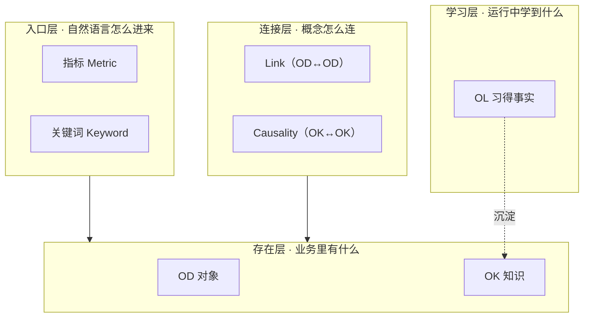
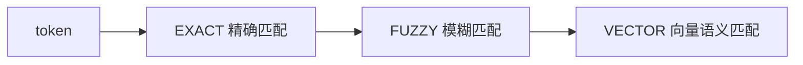

# 核心概念

> 本体、OD、指标、关键词、两个 Agent 模式、三级召回,以及三条硬不变量。

---

这是本体系统的「名词表」。你不需要全懂,但**至少要懂 OD、指标、关键词这三个**,因为日常纠错就是在这三处操作。

> **术语统一说明**:界面和代码里叫 **「指标 / Metric」** 的东西,在早期宣言/设计哲学里叫 **「意图 / Intent」**,数据库表名是 `lakehouse_metric_intent`——**三者是同一个概念**。本文一律使用「指标」。

## 本体的 7 个核心概念

| 概念 | 中文 | 物理表 | 它解决的张力 | 用户要不要碰 |
|---|---|---|---|---|
| **OD**(Object Definition) | 对象 / 本体对象 | `ont_object_type` + `ont_property` | 业务实体 vs 物理表 解耦 | ★ 要懂 |
| **Property** | 属性 | `ont_property` | 一个 OD 的字段/维度/度量 | ★ 要懂 |
| **Link** | 关系 | `ont_link_type` | 把物理 JOIN 路径显式化(OD↔OD) | 了解即可 |
| **OK**(Knowledge) | 知识 | `ont_knowledge` | 业务结构 vs 业务知识 分离 | 进阶 |
| **OL**(Learned-fact) | 习得事实 | `ont_learned_fact` | 静态知识 vs 动态学习 共存 | 进阶 |
| **Causality** | 因果 | `ont_causality` | 业务因果 vs 物理关系 区分 | 进阶 |
| **指标 / Metric** | 指标 | `lakehouse_metric_intent` | 把「自然语言的模糊」桥接到「SQL 的确定」 | ★★ 重点 |
| **关键词 / Keyword** | 关键词 | `lakehouse_keyword` | 双通道入口:字面匹配 + 语义匹配 | ★★ 重点 |

## 三层本体生命周期

依赖**单向向下**:入口层引用存在层,连接层架在存在层之上,学习层是副产品。

## 几个关键关系

- **OD 和 Property**:一个 OD 就是一个「业务对象」(比如「订单」),它下面挂若干 Property(字段/维度/度量,比如「订单数量」「地区」「下单日期」)。一个 OD 对应**恰好一条** `semantic_sql`,这条 SQL 可以横跨任意多张物理表——**物理表是实现细节,OD 是业务封装**。
- **指标 和 关键词**:**指标**是一个查询模板(锚定在某个 OD 上,包含 度量 / 过滤 / 自动分组 / 透视配置);**关键词**是触发词(指向某个 Property,或指向某个指标)。两者合起来把「人话」变成「确定的查询」。
- **OD 和 OK**:OK 只能依附 OD 存在,是 OD 的「语义补丁」(比如「本公司早单的业务定义」)。

## 为什么多表查询不再是问题

Text-to-SQL 真正失败的原因不是 LLM 不会写 SQL,而是在多表查询里,**LLM 要同时决定三件事**:哪些表、怎么 JOIN、WHERE/GROUP BY 怎么排。错一个整条就错。过了三张表,准确率断崖。

本体架构把这三个决定**物理分开**:

| 决定 | 由谁 | 怎么做 |
|---|---|---|
| 涉及哪些业务对象 | LLM | 从已连好的 OD 网络里挑(有限集选择) |
| 用哪种查询形态 | LLM | 从绑定到这些 OD 的指标里挑(有限集选择) |
| 参数 | LLM | 从问题里召回关键词(召回,不是生成) |
| **JOIN / SQL 拼装** | **SmartQuery 引擎** | **沿 Link 机械拼接,无 LLM 参与** |

> **LLM 永远看不到 JOIN。** 它做的全是「从有限集里挑」,不是「写」。拼装由 `lakehouse-sql-server` 的确定性后端代码完成。

## 三级级联召回(运行时核心,无 LLM)

用户每问一句话,系统**强制分词**,每个 token 走三级级联匹配:

> **「分词 + 召回」是确定性的后端 SQL 代码,没有 LLM。**
> **LLM 是受约束的执行器,不是真理来源——它只能从「召回出来的上下文」里挑、填参数、调工具。**

向量召回用 `bge-large-zh` 嵌入,向量列是 `vector(1024)`(pgvector)。所以**要让语义召回生效,需要在 LLM 配置里配一个 embedding 模型**。

## 两个 Agent 模式

系统里跑两个**互相独立**的 Agent 模式,由线程上的 `agent_type` 区分(一旦设定不可改):

| 模式 | 中文 | 干什么 |
|---|---|---|
| **lakehouse** | 湖仓(查询)模式 | 自然语言 → 召回 → 选指标填参 → SmartQuery → 答案 |
| **builder** | 构建(建模)模式 | 访谈式地创建 OD / 指标 / Link,**人工激活**后才生效 |

## 三条硬不变量(由架构强制,绕不过去)

1. **OD 必要性**:一个项目没有 active 的 OD,查询工具拒绝执行——答不了任何业务问题。
2. **OD 1:1 semantic_sql**:每个 active OD 恰好有一条 SQL 定义(可引用多张物理表)。
3. **无孤岛 OD**:当 active OD 多于一个时,任意 active OD 必须通过至少一条 active Link 连到另一个 active OD。
