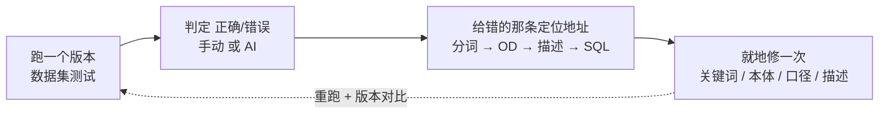

# 调试循环

> 每个错误都有地址。先查分词,再查 OD,再查描述,最后查 SQL——一棵决策树。

---

答错时,不要重试、不要换 prompt。每个错误都有一个**地址**——沿着下面这棵决策树,找到它、修一次。

## 这是一个环,不是一锤子买卖

调试不是"出了错临时救火",它是这套系统**主要的工作方式**。把它看成一个环:

[问题集](/zh/docs/question-sets/)给你**入口**(哪几条错了),这个环告诉你**每条错的地址在哪、怎么修一次就不再回来**。那条虚线是关键:修完**重跑一个新版本、做 N 路对比**,你会亲眼看到修对的题不再回退——这就是这套系统区别于传统 BI 的那个棘轮。

## 调试在哪儿发生:用例详情就是你的驾驶舱

不用到处找线索。在**数据集测试**里点开任意一条用例,它的详情面板已经把现场摆好了:

- **分词**(这句话被切成了哪些 token、各自命中了什么)
- **每一轮工具调用**(LLM 选了哪个口径、填了什么参数)
- **`generated_sql`**(SmartQuery 实际拼出来的 SQL)
- **执行结果 / 报错**
- **最终答案**

也就是说,从"答错"到"看见为什么错",中间没有黑盒。下面这棵决策树,就是你拿着这份现场往下走的顺序。

## 决策树:从分词往下查

### ① 第一反应:查分词

**当用户的提问和你的预期不符、或者干脆查不出数据时,你的第一反应应该是检查分词对不对。**

分词是整套系统的命门(60%+ 的环节依赖它)。它的作用是**让大语言模型理解你问题里的关键词**;关键词对了,系统才能反推出正确的本体和属性。

去 **Agent → Token 召回**(`/ontology/lakehouse-agent/token-recall`)看这句话被怎么分词、召回到了什么;去 **知识工程 → 关键词分诊**(`/ontology/lakehouse-keyword-triage`)补缺词、纠别名、调优先级。

> **关于分词的实话**:目前分词还没有一个特别好的通用办法。当你的领域很特定、或问题涉及复杂的专有关键词时,坦率讲没有银弹——这就是为什么它是你最该花时间盯的地方。

### ② 分词对了还是错 → 查 LLM 找到的 OD 对不对

如果分词一切正确、但结果依然有问题,**下一步去看大语言模型找到的本体(OD)对不对。** 用例详情里的工具调用轮次会直接告诉你它锚定了哪个 OD。

### ③ OD 不对 → 回头看本体描述

如果它找到的本体本身就不对,**回去重新考虑:你在本体上的(自然语言)描述是否正确?** 描述是 Agent 理解本体的依据(见 [第 2 步](/zh/docs/builder-mode/));描述含糊或有歧义,OD 就会被选错。

### ④ OD 对了但数不对 → 查属性 / 表 / SQL / 主外键

如果找到的本体也对,但**查出来的数有问题**,那说明问题出在更下层:**本体的属性,或属性对应的数据库表本身,可能有问题。** 这时对着用例详情里的 `generated_sql` 和执行结果,逐项查:

- `semantic_sql`(描述 SQL)写得对不对?
- 表与表的**主外键 / 关联键**连得对不对?
- 本体、以及本体维度的**文字描述**能不能再优化?
- 是不是有**概念重叠**(两个本体描述的其实是同一件事)?

> 概念重叠往往是隐蔽的错误源。如果发现重叠,回到 [第 2 步](/zh/docs/builder-mode/) 的"概念融合"原则:能融合成一个本体就别拆。

## 现象 → 去哪修(速查)

| 现象 | 去哪修 | 页面 |
|---|---|---|
| 分词不对 / 没看懂某个词 | **关键词分诊** | `/ontology/lakehouse-keyword-triage` |
| 想看分词与召回过程 | **Token 召回** | `/ontology/lakehouse-agent/token-recall` |
| 现有指标覆盖不了某维度 | **指标**(新建) | `/ontology/lakehouse-metrics` |
| 关键词增删改 | **关键词** | `/ontology/lakehouse-keywords` |
| OD 描述 / semantic_sql / 属性 / Link | **本体** | `/ontology/lakehouse-objects` |
| 给 Agent 决策打标注、确认分词 | **标注** | `/ontology/lakehouse-agent/annotations` |
| 批量回归、版本间对比、看用例现场 | **数据集测试** | `/ontology/lakehouse-agent/dataset-testing` |

## 为什么值得

你要 curate(策展)、annotate(标注)、activate(激活),它不会十五分钟开箱即用。换来的是:**一旦一个答案被修对,它就保持对**——因为错误有地址,修在那里,同一类错误下周不会再回来。每修一次,系统就更准一点,而且**修过的不退**。这种逐周复利、看得见的收敛,是传统 BI 和"换个更大模型"都给不了的。
