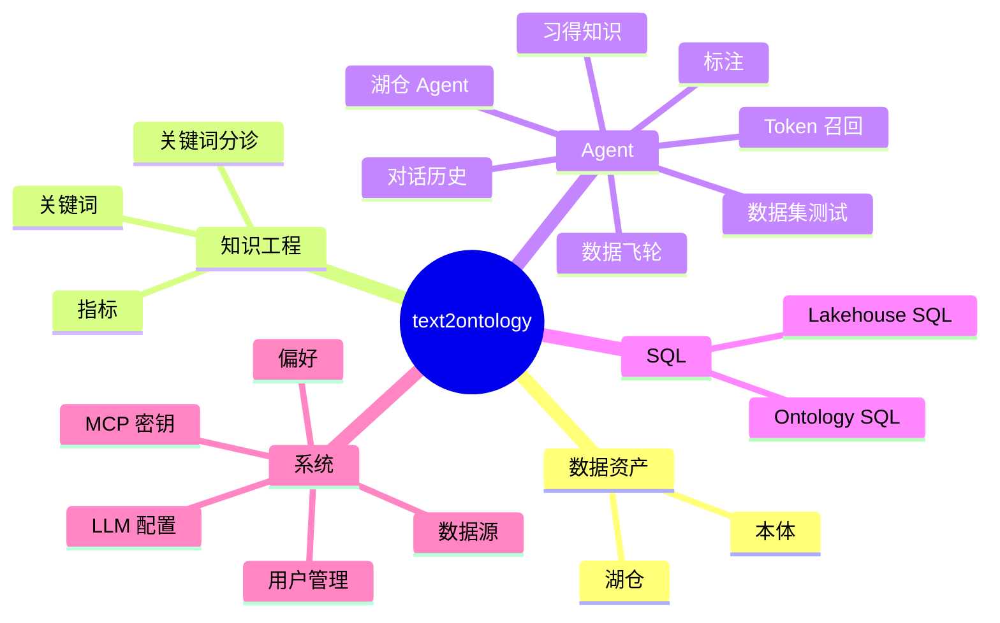

# 界面参考

> 侧边栏地图——每个页面是干什么的。

---

登录并选中一个项目后,侧边栏分组如下(没选项目时只显示「系统」组)。

> 左上角是**项目切换器**(切换 / 新建 / 删除项目)。

**路由速查**

| 分组 | 页面 | 路由 |
|---|---|---|
| 数据资产 | 湖仓 | `/ontology/lakehouse` |
| 数据资产 | 本体(OD 列表 + 属性图) | `/ontology/lakehouse-objects` |
| 知识工程 | 关键词 | `/ontology/lakehouse-keywords` |
| 知识工程 | 关键词分诊 | `/ontology/lakehouse-keyword-triage` |
| 知识工程 | 指标 | `/ontology/lakehouse-metric-intents` |
| Agent | 湖仓 Agent(主对话) | `/ontology/lakehouse-agent` |
| Agent | 对话历史 | `/ontology/lakehouse-agent/history` |
| Agent | 标注 | `/ontology/lakehouse-agent/annotations` |
| Agent | Token 召回 | `/ontology/lakehouse-agent/token-recall` |
| Agent | 习得知识 | `/ontology/lakehouse-agent/knowledge-learned` |
| Agent | 数据集测试 | `/ontology/lakehouse-agent/dataset-testing` |
| Agent | 数据飞轮 | `/ontology/lakehouse-agent/flywheel` |
| SQL | Ontology SQL | `/ontology/sql-passthrough` |
| SQL | Lakehouse SQL | `/ontology/lakehouse-sql` |
| 系统 | 数据源 | `/settings/data-sources` |
| 系统 | LLM 配置 | `/settings/llm-config` |
| 系统 | MCP 密钥 | `/settings/mcp-keys` |
| 系统 | 偏好 | `/settings/preferences` |
| 系统 | 用户管理(仅管理员) | `/settings/users` |

## 逐组说明

### 数据资产

- **湖仓** —— 看接进来的物理数据。
- **本体** —— OD 列表 + 属性图(合并在一个分屏视图里)。这是你查看 / 管理 OD 和 Property 的地方。

### 知识工程(纠错主战场)

- **关键词** —— 关键词的增删改查。
- **关键词分诊** —— 修分词:补缺词、纠别名、调指标优先级。
- **指标** —— 新建 / 编辑指标(度量、过滤、自动分组、透视)。

### Agent

- **湖仓 Agent** —— 主对话页,湖仓(查询)/ 构建(建模)两个模式都在这里。
- 其余子页:对话历史、标注、Token 召回、习得知识、数据集测试、数据飞轮。

### SQL(进阶)

- **Ontology SQL** —— 本体语义 SQL。
- **Lakehouse SQL** —— 直查 lakehouse。

### 系统

- **数据源 / LLM 配置 / MCP 密钥 / 偏好**,以及仅管理员可见的 **用户管理**。

> 注:ER 图(`/ontology/er-diagram`)、Prompt 工程(`/settings/prompt-config`)两个页面文件还在,但已从侧边栏隐藏。所有路由实际挂在 `/lakehouse` base path + 语言段下。
