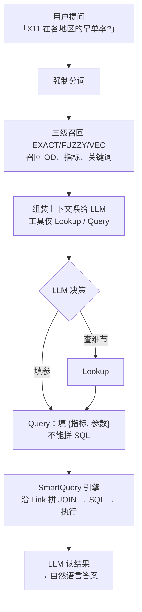

# 查询模式:提问

> 一次提问如何走到答案、任务可达器,以及为什么 AI 从不编造数字。

---

本体激活后,在 **Agent → 湖仓 Agent** 切到**湖仓(lakehouse)查询模式**,开始问问题。

## 一次提问内部发生了什么

## 两个对用户很关键的「诚实机制」

### 1. 提问前先判断「这问题到底能不能答」(任务可达器)

系统会先把问题拆成它需要的维度 / 过滤,**逐项对照已授权的指标做机械检查**。只要有一项覆盖不了 → 整个问题判为「不可达」→ **拒绝回答 + 给出精确理由**(例如「没有授权指标提供『某某』这个维度」)。

这是**二元的、整句级**的——**宁可不答,也不答错**。它还支持**追问 / 上下文**(把前几轮的提问和 AI 最终答案带进来一起判断)。

### 2. AI 最终答案里的数字一定来自查询结果,不会编造

在整条工具调用链里,LLM **从不写一个数字**——它发出的都是结构化引用(类似 `t1.qty[3]` 这种指针),由机械层把指针解析成真值。任何「从工具结果里抄数字」的行为都会在拦截器处被判为 `POINTER_INVARIANT_VIOLATED`。

> **用户最终看到的数字 = 工具实际返回的数字,编造数字的可能性被结构性消除了。**

## 心理预期

**第一次的答案大概率会偏。这是正常的。** 这套系统的智能是**积累出来的,不是模型一次给的**。每问一次,都是一次「教学」而不是「消费」——你纠正一次,系统下一次就更准。

> 跳过纠正 → 永远停在冷启动;坚持纠正 → 错误率逐周复利式下降。

答错了不要重试、不要换 prompt——去对应的「地址」修一次。怎么修,见 **[纠错飞轮](/zh/docs/correction-flywheel/)**。
